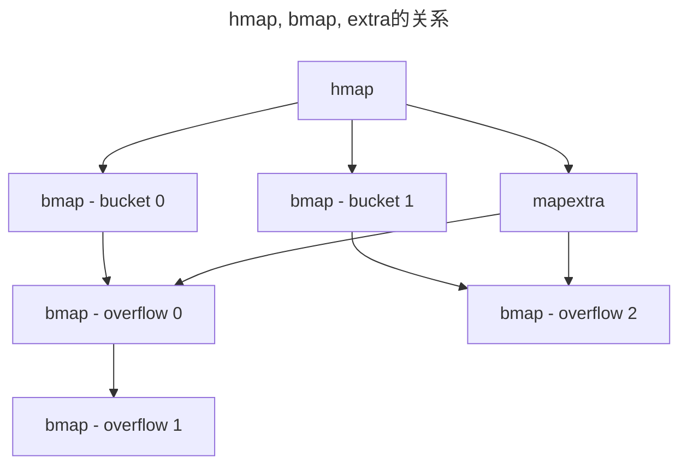
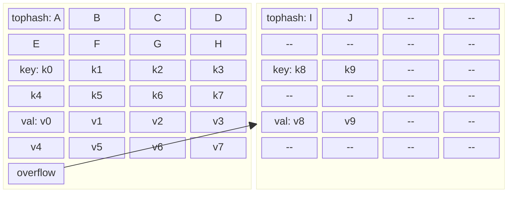

> [!IMPORTANT]
> 在撰写本文时Golang的最新版本是1.24，请注意部分内容的时效性哦～

听闻Golang在最新的1.24版本中，新增了基于 SwissTable 设计的全新内置 map 类型的实现，没想到技术迭代就发生在身边。那Golang为什么要选择更改map的实现呢，是不是SwissTable性能更好更优秀呢，要想知道根本原因，肯定需要了解两种map底层实现，那我们先从原本的map开始吧！

## 引子

- 源码的位置：`src/map/map_noswiss.go`

1. map的底层结构是什么样子的，容量是固定的吗还是可扩展的？
2. 为什么说map不是并发安全的结构？
3. 为了提高map的性能都做了哪些努力

## map的结构

### map header

hmap是map的具体实现结构

```go:line-numbers=113
// A header for a Go map.
type hmap struct {
	// Note: the format of the hmap is also encoded in cmd/compile/internal/reflectdata/reflect.go.
	// Make sure this stays in sync with the compiler's definition.
	count     int // # live cells == size of map.  Must be first (used by len() builtin)
	flags     uint8
	B         uint8  // log_2 of # of buckets (can hold up to loadFactor * 2^B items)
	noverflow uint16 // approximate number of overflow buckets; see incrnoverflow for details
	hash0     uint32 // hash seed

	buckets    unsafe.Pointer // array of 2^B Buckets. may be nil if count==0.
	oldbuckets unsafe.Pointer // previous bucket array of half the size, non-nil only when growing
	nevacuate  uintptr        // progress counter for evacuation (buckets less than this have been evacuated)
	clearSeq   uint64

	extra *mapextra // optional fields
}
```
1. `count`: 当前存储的kv数量
2. `flags`: 当前状态
3. `B`: 可通过位运算得出普通bucket的数量`1<<B`，对比直接存实际数据性能比较高
4. `noverflow`: 溢出bucket近似数量
5. `buckets`: 普通bucket的数组
6. `oldbuckets`: 同样也是哈希桶数组，但是只会在增量扩容时起作用
7. `nevacuate`: 记录迁移进度
8. `extra`: 用来存放溢出桶的指针



### map bucket

bmap是map中每个bucket的具体实现结构，但是在运行时会比表面上看上去更复杂

```go:line-numbers=148
// A bucket for a Go map.
type bmap struct {
	// tophash generally contains the top byte of the hash value
	// for each key in this bucket. If tophash[0] < minTopHash,
	// tophash[0] is a bucket evacuation state instead.
	tophash [abi.OldMapBucketCount]uint8
	// Followed by bucketCnt keys and then bucketCnt elems.
	// NOTE: packing all the keys together and then all the elems together makes the
	// code a bit more complicated than alternating key/elem/key/elem/... but it allows
	// us to eliminate padding which would be needed for, e.g., map[int64]int8.
	// Followed by an overflow pointer.
}
```

- `tophash`：是一个数组，存储了这个bucket中所有key的hash的高八位，容量是一个常量，定义在abi包下，其中也定义了其他相关的变量，估计是为了性能调优。
- `key-value`：并没有显式出现在结构体中，而是手操内存打包再放入结构体中，在运行时也是通过偏移量访问。而且在其中存储是按照 key1/key2/value1/value2 的顺序，因为key和key的类型一致，val和val的类型一致，放到一起有利于内存对齐，减少不必要的空间浪费。
- `overflow bucket pointer`: 如果bucket的空间不足，会分配溢出桶来承接新的key-value。



## extra 的作用

```go:line-numbers=131
// mapextra holds fields that are not present on all maps.
type mapextra struct {
	// If both key and elem do not contain pointers and are inline, then we mark bucket
	// type as containing no pointers. This avoids scanning such maps.
	// However, bmap.overflow is a pointer. In order to keep overflow buckets
	// alive, we store pointers to all overflow buckets in hmap.extra.overflow and hmap.extra.oldoverflow.
	// overflow and oldoverflow are only used if key and elem do not contain pointers.
	// overflow contains overflow buckets for hmap.buckets.
	// oldoverflow contains overflow buckets for hmap.oldbuckets.
	// The indirection allows to store a pointer to the slice in hiter.
	overflow    *[]*bmap
	oldoverflow *[]*bmap

	// nextOverflow holds a pointer to a free overflow bucket.
	nextOverflow *bmap
}
```

Golang的GC会扫描所有的变量，如果这个变量所在的空间内有地址，就说明存在引用关系，于是下一步就会扫描被引用的地址的变量，直至到达叶节点。问题在于，既然我们的bucket中也是有指针指向下一个overflow bucket的，那么为什么还要一个额外的地址切片记录指针的位置呢？

这个问题的答案比较复杂，首先是GC在扫描一个变量的时候会先查看变量的type，在其中会涉及到这个变量是否有指针，如果没有指针就会被GC跳过。而map是golang内部实现的，在这方面就可以很灵活灵活，如果key和value都不含指针就会把map标记为值类型，GC就会跳过，而当map有溢出桶时，为了防止溢出桶被GC回收，这个时候会标记为指针类型。

- 源码地址 `src/internal/abi/type.go`

```go
type Type struct {
	// ...
	PtrBytes    uintptr // number of (prefix) bytes in the type that can contain pointers
	GCData    *byte
	// ...
}
```

我也没有深入研究，但是在这个Type的结构体中这两个字段是和GC有关的，都是一定程度上影响GC扫描的区域，大家有兴趣也可以去看看。

因此，如果设计上允许，在项目中最好使用非指针类型的key和value，可以有效缓解GC压力。

## make 初始化

### makemap

我们在业务开发中使用map前都会先进行初始化，也就是 `make(map[k]v, hint)`，需要传入这个map的kv的类型，以及map初始容量的大小也就是hint

1. **计算所需桶的空间占用**
```go:line-numbers=323
// makemap implements Go map creation for make(map[k]v, hint).
// If the compiler has determined that the map or the first bucket
// can be created on the stack, h and/or bucket may be non-nil.
// If h != nil, the map can be created directly in h.
// If h.buckets != nil, bucket pointed to can be used as the first bucket.
//
// makemap should be an internal detail,
// but widely used packages access it using linkname.
// Notable members of the hall of shame include:
//   - github.com/ugorji/go/codec
//
// Do not remove or change the type signature.
// See go.dev/issue/67401.
//
//go:linkname makemap
func makemap(t *maptype, hint int, h *hmap) *hmap {
	mem, overflow := math.MulUintptr(uintptr(hint), t.Bucket.Size_)
	if overflow || mem > maxAlloc {
		hint = 0
	}
```
- map所需的内存空间，也就是`hint` `*` `map中每个bucket的大小`。
- 但是如果预先分配所需的空间太大了，说明`hint`不合理，后面就不会理睬这个值了，而是从最小容量开始渐进扩容。

2. **申请hmap空间**
```go:line-numbers=330
	// initialize Hmap
	if h == nil {
		h = new(hmap)
	}
	h.hash0 = uint32(rand())
```
- 向golang的内存分配器申请一块hmap的空间。
- 因为hmap中bucket相关的字段是指针，所以这里分配的空间是一个较小的固定值，整个map实际所占用的空间还要加上上一个步骤计算得出的。

3. **申请桶空间**
```go:line-numbers=336
	// Find the size parameter B which will hold the requested # of elements.
	// For hint < 0 overLoadFactor returns false since hint < bucketCnt.
	B := uint8(0)
	for overLoadFactor(hint, B) {
		B++
	}
	h.B = B

	// allocate initial hash table
	// if B == 0, the buckets field is allocated lazily later (in mapassign)
	// If hint is large zeroing this memory could take a while.
	if h.B != 0 {
		var nextOverflow *bmap
		h.buckets, nextOverflow = makeBucketArray(t, h.B, nil)
		if nextOverflow != nil {
			h.extra = new(mapextra)
			h.extra.nextOverflow = nextOverflow
		}
	}

	return h
}
```
- 寻找到一个合适的桶数量，足够容纳hint数量的元素，同时不超过溢出阈值 *13/16*，然后向golang的内存分配器申请所有bucket的空间。
- 因为没有初始化容量的map，也就是hint为0时，走渐进式扩容，不走这里的预先分配，因为预先设定了最大元素数量并且桶的数量很少，所以在运行时有可能溢出，但是溢出不太可能。
- 此外当判断不需要overflowbucket的时候不会为extra分配空间，这是map的懒加载策略，等后面元素增加后再考虑分配内存。

### makeBucketArray

1. **计算桶数量**
```go:line-numbers=359
// makeBucketArray initializes a backing array for map buckets.
// 1<<b is the minimum number of buckets to allocate.
// dirtyalloc should either be nil or a bucket array previously
// allocated by makeBucketArray with the same t and b parameters.
// If dirtyalloc is nil a new backing array will be alloced and
// otherwise dirtyalloc will be cleared and reused as backing array.
func makeBucketArray(t *maptype, b uint8, dirtyalloc unsafe.Pointer) (buckets unsafe.Pointer, nextOverflow *bmap) {
	base := bucketShift(b)
	nbuckets := base
	// For small b, overflow buckets are unlikely.
	// Avoid the overhead of the calculation.
	if b >= 4 {
		// Add on the estimated number of overflow buckets
		// required to insert the median number of elements
		// used with this value of b.
		nbuckets += bucketShift(b - 4)
		sz := t.Bucket.Size_ * nbuckets
		up := roundupsize(sz, !t.Bucket.Pointers())
		if up != sz {
			nbuckets = up / t.Bucket.Size_
		}
	}

```
- 按照比例 1/16 计算预分配的overflow桶的数量。

2. **分配桶空间**
```go:line-numbers=382
	if dirtyalloc == nil {
		buckets = newarray(t.Bucket, int(nbuckets))
	} else {
		// dirtyalloc was previously generated by
		// the above newarray(t.Bucket, int(nbuckets))
		// but may not be empty.
		buckets = dirtyalloc
		size := t.Bucket.Size_ * nbuckets
		if t.Bucket.Pointers() {
			memclrHasPointers(buckets, size)
		} else {
			memclrNoHeapPointers(buckets, size)
		}
	}

	if base != nbuckets {
		// We preallocated some overflow buckets.
		// To keep the overhead of tracking these overflow buckets to a minimum,
		// we use the convention that if a preallocated overflow bucket's overflow
		// pointer is nil, then there are more available by bumping the pointer.
		// We need a safe non-nil pointer for the last overflow bucket; just use buckets.
		nextOverflow = (*bmap)(add(buckets, base*uintptr(t.BucketSize)))
		last := (*bmap)(add(buckets, (nbuckets-1)*uintptr(t.BucketSize)))
		last.setoverflow(t, (*bmap)(buckets))
	}
	return buckets, nextOverflow
}
```
- 调用分配数组的方法为所有的bucket分配空间，包括普通bucket和预分配的overflowbucket，并在结构体中声明好这些分配的overflowbucket空间。
- 如果传进来了dirtyalloc，则是从clear map走进来的，而不是make map，这个流程中会回收旧的bucket的空间并请求新的空间。感觉这里是因为循环遍历再初始化时间复杂度太高，加上原本可能进行过扩容导致超出了hint，所以没有复用之前的空间，干脆一次性回收。

## assign 插入或更新

当我们使用 `map[key] = value`时，其实是Insert/Update的操作，会先查找这个key并更新其value，如果当前的map中没有这个key就执行插入的逻辑，先后顺序是很重要的，毕竟如果一个key对应着两个value的话那可就全乱套了。

1. **前置检查**
```go:line-numbers=606
// Like mapaccess, but allocates a slot for the key if it is not present in the map.
//go:linkname mapassign
func mapassign(t *maptype, h *hmap, key unsafe.Pointer) unsafe.Pointer {
	if h == nil {
		panic(plainError("assignment to entry in nil map"))
	}
	if raceenabled {
		callerpc := sys.GetCallerPC()
		pc := abi.FuncPCABIInternal(mapassign)
		racewritepc(unsafe.Pointer(h), callerpc, pc)
		raceReadObjectPC(t.Key, key, callerpc, pc)
	}
	if msanenabled {
		msanread(key, t.Key.Size_)
	}
	if asanenabled {
		asanread(key, t.Key.Size_)
	}
	if h.flags&hashWriting != 0 {
		fatal("concurrent map writes")
	}
	// ...
```
- 如果map没有初始化，发生panic
- 一些编译时的选项，包括竞争分析，编译器设置等等
- 如果发现有goroutine正在写map，并发写会发生fatal，因为map并不是一个并发安全的结构。并发读写也会发生fatal。其实可以看到在查询是否并发操作的时候并没有使用原子操作，理论上也会有并发读写或者并发写的同时，程序并没有检测到，所以还是要在代码设计时就去避免～

2. **找到常规桶**
```go:line-numbers=639
	hash := t.Hasher(key, uintptr(h.hash0))

	// Set hashWriting after calling t.hasher, since t.hasher may panic,
	// in which case we have not actually done a write.
	h.flags ^= hashWriting

	if h.buckets == nil {
		h.buckets = newobject(t.Bucket) // newarray(t.Bucket, 1)
	}

again:
	bucket := hash & bucketMask(h.B)
	if h.growing() {
		growWork(t, h, bucket)
	}
	b := (*bmap)(add(h.buckets, bucket*uintptr(t.BucketSize)))
	top := tophash(hash)

	var inserti *uint8
	var insertk unsafe.Pointer
	var elem unsafe.Pointer
```
- 使用哈希函数对key进行哈希运算，然后取余，得到的值必定小于常规桶的数量，根据桶的大小计算偏移量，就可以找到对应的常规桶。
- 如果map正在扩容，会辅助扩容进行一两个桶的迁移，这个后面会细说。

3. **查找key**
```go:line-numbers=660
bucketloop:
	for {
		for i := uintptr(0); i < abi.OldMapBucketCount; i++ {
			if b.tophash[i] != top {
				if isEmpty(b.tophash[i]) && inserti == nil {
					inserti = &b.tophash[i]
					insertk = add(unsafe.Pointer(b), dataOffset+i*uintptr(t.KeySize))
					elem = add(unsafe.Pointer(b), dataOffset+abi.OldMapBucketCount*uintptr(t.KeySize)+i*uintptr(t.ValueSize))
				}
				if b.tophash[i] == emptyRest {
					break bucketloop
				}
				continue
			}
			k := add(unsafe.Pointer(b), dataOffset+i*uintptr(t.KeySize))
			if t.IndirectKey() {
				k = *((*unsafe.Pointer)(k))
			}
			if !t.Key.Equal(key, k) {
				continue
			}
			// already have a mapping for key. Update it.
			if t.NeedKeyUpdate() {
				typedmemmove(t.Key, k, key)
			}
			elem = add(unsafe.Pointer(b), dataOffset+abi.OldMapBucketCount*uintptr(t.KeySize)+i*uintptr(t.ValueSize))
			goto done
		}
		ovf := b.overflow(t)
		if ovf == nil {
			break
		}
		b = ovf
	}
```
- 从常规桶开始查找key，如果没有那么就去查找溢出桶，没找到就继续向下递归，这是外层的for循环。
- 具体到每一个桶内的for循环，查找流程是先遍历所有的tophash，如果tophash相同意味着hash有可能相同，再去真正的key存储的位置进一步判断。如果tophash不相同，意味着hash一定不同，就不用再去比较key了。之所以这里存储的是tophash而不是hash，是为了提高遍历和对比的速度，毕竟就算去比较完整的hash，也可能不是同一个key，如果直接跳过hash直接对比key，又会面临大key的对比问题，明显消耗更大。
- 如果在循环的过程中遇到了空位置，会记录在`inserti`中，也就是当key不存在时直接将kv存入这个位置。
- 如果tophash相同，就会计算偏移量得到key的位置并比较key，如果key也相同就执行更新的操作。
- 如果查找到了key就goto到done，没有找到就继续向下执行。

4. **是否需要开始扩容**
```go:line-numbers=695
	// Did not find mapping for key. Allocate new cell & add entry.

	// If we hit the max load factor or we have too many overflow buckets,
	// and we're not already in the middle of growing, start growing.
	if !h.growing() && (overLoadFactor(h.count+1, h.B) || tooManyOverflowBuckets(h.noverflow, h.B)) {
		hashGrow(t, h)
		goto again // Growing the table invalidates everything, so try again
	}
```

5. **insert**
```go:line-numbers=704
	if inserti == nil {
		// The current bucket and all the overflow buckets connected to it are full, allocate a new one.
		newb := h.newoverflow(t, b)
		inserti = &newb.tophash[0]
		insertk = add(unsafe.Pointer(newb), dataOffset)
		elem = add(insertk, abi.OldMapBucketCount*uintptr(t.KeySize))
	}

	// store new key/elem at insert position
	if t.IndirectKey() {
		kmem := newobject(t.Key)
		*(*unsafe.Pointer)(insertk) = kmem
		insertk = kmem
	}
	if t.IndirectElem() {
		vmem := newobject(t.Elem)
		*(*unsafe.Pointer)(elem) = vmem
	}
	typedmemmove(t.Key, insertk, key)
	*inserti = top
	h.count++
```
- 如果常规桶和溢出桶都满了就会分配新的溢出桶，然后将kv插入，最后不要忘了把count++

6. **done**
```go:line-numbers=726
done:
	if h.flags&hashWriting == 0 {
		fatal("concurrent map writes")
	}
	h.flags &^= hashWriting
	if t.IndirectElem() {
		elem = *((*unsafe.Pointer)(elem))
	}
	return elem
}
```
- 最后再检查一下是否存在并发写，然后返回value值

## access 访问

访问map的元素会执行access的逻辑，比如`val := map[key]`。顺便一提，除了 `mapaccess1` 还有其他的相关函数，主要逻辑都是相同的，只是为了方便使用多了一些额外返回值，比如:

- `mapaccess2`: 多了key是否存在的返回值，`val, exist := map[key]`。
- `mapaccessK`: 多了key的返回值，在range map的时候会用到，`for key, val := range map {}`。

## delete 删除

```go
const (
	// Possible tophash values. We reserve a few possibilities for special marks.
	// Each bucket (including its overflow buckets, if any) will have either all or none of its
	// entries in the evacuated* states (except during the evacuate() method, which only happens
	// during map writes and thus no one else can observe the map during that time).
	emptyRest      = 0 // this cell is empty, and there are no more non-empty cells at higher indexes or overflows.
	emptyOne       = 1 // this cell is empty
	evacuatedX     = 2 // key/elem is valid.  Entry has been evacuated to first half of larger table.
	evacuatedY     = 3 // same as above, but evacuated to second half of larger table.
	evacuatedEmpty = 4 // cell is empty, bucket is evacuated.
	minTopHash     = 5 // minimum tophash for a normal filled cell.
)
```
- 主体的逻辑与插入基本相同。不同之处在于会判断删除元素是否是最后一个元素，如果是的话就会在tophash做一个标记，方便在后续执行中判断是否是整个bucket和overflowbucket链条的尾部，从而避免再去遍历剩余的slot和bucket。

- 在删除map元素致使map空了的时候，会重新创建一个哈希随机值，可以一定程度上预防有人想要碰撞哈希值。


## grow 渐进扩容

### 判断是否需要扩容

1. **update/insert**
```go:line-numbers=697
	// If we hit the max load factor or we have too many overflow buckets,
	// and we're not already in the middle of growing, start growing.
	if !h.growing() && (overLoadFactor(h.count+1, h.B) || tooManyOverflowBuckets(h.noverflow, h.B)) {
		hashGrow(t, h)
		goto again // Growing the table invalidates everything, so try again
	}
```
- 如果负载率太高或者溢出桶太多都会触发扩容
- 偏向于只扩不缩，避免在扩容临界点多次增加或删除导致容量抖动

2. **是否正在扩容**
```go:line-numbers=1181
func (h *hmap) growing() bool {
	return h.oldbuckets != nil
}
```
- 判断是否在扩容的依据是oldbuckets的指针是否为空，此处并没有为grow额外分配一个flag

3. **负载过高**
```go:line-numbers=72
const (
	// Maximum average load of a bucket that triggers growth is bucketCnt*13/16 (about 80% full)
	// Because of minimum alignment rules, bucketCnt is known to be at least 8.
	// Represent as loadFactorNum/loadFactorDen, to allow integer math.
	loadFactorDen = 2
	loadFactorNum = loadFactorDen * abi.OldMapBucketCount * 13 / 16.
)
```
```go:line-numbers=1161
// overLoadFactor reports whether count items placed in 1<<B buckets is over loadFactor.
func overLoadFactor(count int, B uint8) bool {
	return count > abi.OldMapBucketCount && uintptr(count) > loadFactorNum*(bucketShift(B)/loadFactorDen)
}
```
- `count > abi.OldMapBucketCount`: 超小规模的map时空复杂度都不高，没有必要扩容
- `uintptr(count) > loadFactorNum*(bucketShift(B)/loadFactorDen)`: 负载高于 6.5(负载因子) / 8(桶中槽位)，即触发扩容

4. **溢出桶过多**
```go:line-numbers=1166
// tooManyOverflowBuckets reports whether noverflow buckets is too many for a map with 1<<B buckets.
// Note that most of these overflow buckets must be in sparse use;
// if use was dense, then we'd have already triggered regular map growth.
func tooManyOverflowBuckets(noverflow uint16, B uint8) bool {
	// If the threshold is too low, we do extraneous work.
	// If the threshold is too high, maps that grow and shrink can hold on to lots of unused memory.
	// "too many" means (approximately) as many overflow buckets as regular buckets.
	// See incrnoverflow for more details.
	if B > 15 {
		B = 15
	}
	// The compiler doesn't see here that B < 16; mask B to generate shorter shift code.
	return noverflow >= uint16(1)<<(B&15)
}
```
- 当溢出桶的数量大于等于普通桶的数量，就会触发扩容

### hashGrow 扩容初始化

1. **扩容初始化**
```go:line-numbers=1118
func hashGrow(t *maptype, h *hmap) {
	// If we've hit the load factor, get bigger.
	// Otherwise, there are too many overflow buckets,
	// so keep the same number of buckets and "grow" laterally.
	bigger := uint8(1)
	if !overLoadFactor(h.count+1, h.B) {
		bigger = 0
		h.flags |= sameSizeGrow
	}
	oldbuckets := h.buckets
	newbuckets, nextOverflow := makeBucketArray(t, h.B+bigger, nil)

	flags := h.flags &^ (iterator | oldIterator)
	if h.flags&iterator != 0 {
		flags |= oldIterator
	}
```
- 如果是因为负载率太高，说明元素数量多，则需要增加基础桶分摊元素的存储，那么增量扩容
- 否则就是因为溢出桶太多，元素不多，普通桶和溢出桶空置率太高，则需要重新放置元素让其密集排列，那么等量扩容

2. **数据保存**
```go:line-numbers=1134
	// commit the grow (atomic wrt gc)
	h.B += bigger
	h.flags = flags
	h.oldbuckets = oldbuckets
	h.buckets = newbuckets
	h.nevacuate = 0
	h.noverflow = 0

	if h.extra != nil && h.extra.overflow != nil {
		// Promote current overflow buckets to the old generation.
		if h.extra.oldoverflow != nil {
			throw("oldoverflow is not nil")
		}
		h.extra.oldoverflow = h.extra.overflow
		h.extra.overflow = nil
	}
	if nextOverflow != nil {
		if h.extra == nil {
			h.extra = new(mapextra)
		}
		h.extra.nextOverflow = nextOverflow
	}

	// the actual copying of the hash table data is done incrementally
	// by growWork() and evacuate().
}
```
- 新旧桶交替过程中，因为扩容不是一次完成，而是逐步完成，所以既要保存旧桶也要保存新桶，这样在查找或更新等流程中才不会漏掉旧桶中未被迁移的元素

### growWork 渐进扩容入口函数


```go:line-numbers=1210
func growWork(t *maptype, h *hmap, bucket uintptr) {
	// make sure we evacuate the oldbucket corresponding
	// to the bucket we're about to use
	evacuate(t, h, bucket&h.oldbucketmask())

	// evacuate one more oldbucket to make progress on growing
	if h.growing() {
		evacuate(t, h, h.nevacuate)
	}
}
```
- 每次执行 grow 都会迁移当前的这一个 bucket，同时也会按顺序迁移下一个，也就是在nevacuate位置的 bucket

### evacute 迁移

1. **记录将要迁移的bucket**

```go:line-numbers=1234
func evacuate(t *maptype, h *hmap, oldbucket uintptr) {
	b := (*bmap)(add(h.oldbuckets, oldbucket*uintptr(t.BucketSize)))
	newbit := h.noldbuckets()
	if !evacuated(b) {
		// TODO: reuse overflow buckets instead of using new ones, if there
		// is no iterator using the old buckets.  (If !oldIterator.)

		// xy contains the x and y (low and high) evacuation destinations.
		var xy [2]evacDst
		x := &xy[0]
		x.b = (*bmap)(add(h.buckets, oldbucket*uintptr(t.BucketSize)))
		x.k = add(unsafe.Pointer(x.b), dataOffset)
		x.e = add(x.k, abi.OldMapBucketCount*uintptr(t.KeySize))

		if !h.sameSizeGrow() {
			// Only calculate y pointers if we're growing bigger.
			// Otherwise GC can see bad pointers.
			y := &xy[1]
			y.b = (*bmap)(add(h.buckets, (oldbucket+newbit)*uintptr(t.BucketSize)))
			y.k = add(unsafe.Pointer(y.b), dataOffset)
			y.e = add(y.k, abi.OldMapBucketCount*uintptr(t.KeySize))
		}
```
- 此处使用了容量为2的数组，其中x和y分别记录着低位和高位的bucket，低位的bucket可以理解成旧桶，而高位的bucket是新桶。如果是等量扩容的话，是不需要高位的bucket的。

```go:line-numbers=1196
// noldbuckets calculates the number of buckets prior to the current map growth.
func (h *hmap) noldbuckets() uintptr {
	oldB := h.B
	if !h.sameSizeGrow() {
		oldB--
	}
	return bucketShift(oldB)
}
```
- 从这里可以看出增量扩容，扩容后是原容量的2倍，返回给evacuate中的newbit，其实就是原容量，也是增加的容量。

2. **确定每一个kv的迁移位置**

```go:line-numbers=1257
		for ; b != nil; b = b.overflow(t) {
			k := add(unsafe.Pointer(b), dataOffset)
			e := add(k, abi.OldMapBucketCount*uintptr(t.KeySize))
			for i := 0; i < abi.OldMapBucketCount; i, k, e = i+1, add(k, uintptr(t.KeySize)), add(e, uintptr(t.ValueSize)) {
				top := b.tophash[i]
				if isEmpty(top) {
					b.tophash[i] = evacuatedEmpty
					continue
				}
				if top < minTopHash {
					throw("bad map state")
				}
				k2 := k
				if t.IndirectKey() {
					k2 = *((*unsafe.Pointer)(k2))
				}
				var useY uint8
				if !h.sameSizeGrow() {
					// Compute hash to make our evacuation decision (whether we need
					// to send this key/elem to bucket x or bucket y).
					hash := t.Hasher(k2, uintptr(h.hash0))
					if h.flags&iterator != 0 && !t.ReflexiveKey() && !t.Key.Equal(k2, k2) {
						// If key != key (NaNs), then the hash could be (and probably
						// will be) entirely different from the old hash. Moreover,
						// it isn't reproducible. Reproducibility is required in the
						// presence of iterators, as our evacuation decision must
						// match whatever decision the iterator made.
						// Fortunately, we have the freedom to send these keys either
						// way. Also, tophash is meaningless for these kinds of keys.
						// We let the low bit of tophash drive the evacuation decision.
						// We recompute a new random tophash for the next level so
						// these keys will get evenly distributed across all buckets
						// after multiple grows.
						useY = top & 1
						top = tophash(hash)
					} else {
						if hash&newbit != 0 {
							useY = 1
						}
					}
				}
```
- 遍历这个bucket及旗下所有的overflow bucket，并决定每一对keyvalue是留在旧桶还是放入新桶，如果是等量扩容就略过这一步，因为都是旧桶。
- 因为在扩容时遍历会把新桶旧桶都遍历了，所以在旧桶中需要获取每个keyvalue迁移的位置，如果这个kv在旧桶中将要分配到新桶，那么就跳过，这样才不会重复遍历。

3. **移动到新的位置**

```go:line-numbers=1299
				if evacuatedX+1 != evacuatedY || evacuatedX^1 != evacuatedY {
					throw("bad evacuatedN")
				}

				b.tophash[i] = evacuatedX + useY // evacuatedX + 1 == evacuatedY
				dst := &xy[useY]                 // evacuation destination

				if dst.i == abi.OldMapBucketCount {
					dst.b = h.newoverflow(t, dst.b)
					dst.i = 0
					dst.k = add(unsafe.Pointer(dst.b), dataOffset)
					dst.e = add(dst.k, abi.OldMapBucketCount*uintptr(t.KeySize))
				}
				dst.b.tophash[dst.i&(abi.OldMapBucketCount-1)] = top // mask dst.i as an optimization, to avoid a bounds check
				if t.IndirectKey() {
					*(*unsafe.Pointer)(dst.k) = k2 // copy pointer
				} else {
					typedmemmove(t.Key, dst.k, k) // copy elem
				}
				if t.IndirectElem() {
					*(*unsafe.Pointer)(dst.e) = *(*unsafe.Pointer)(e)
				} else {
					typedmemmove(t.Elem, dst.e, e)
				}
				dst.i++
				// These updates might push these pointers past the end of the
				// key or elem arrays.  That's ok, as we have the overflow pointer
				// at the end of the bucket to protect against pointing past the
				// end of the bucket.
				dst.k = add(dst.k, uintptr(t.KeySize))
				dst.e = add(dst.e, uintptr(t.ValueSize))
			}
		}
```

- 根据上面是分配到新房子还是依旧是老房子的决定，执行搬迁

4. **回收溢出桶**

```go:line-numbers=1332
		// Unlink the overflow buckets & clear key/elem to help GC.
		if h.flags&oldIterator == 0 && t.Bucket.Pointers() {
			b := add(h.oldbuckets, oldbucket*uintptr(t.BucketSize))
			// Preserve b.tophash because the evacuation
			// state is maintained there.
			ptr := add(b, dataOffset)
			n := uintptr(t.BucketSize) - dataOffset
			memclrHasPointers(ptr, n)
		}
	}

	if oldbucket == h.nevacuate {
		advanceEvacuationMark(h, t, newbit)
	}
}
```

- 如果map具有指针，会执行内存上的骚操作 memclrHasPointers，最终释放掉这个 overflowbucket。包括在最上面的todo中也有提到复用 overflowbucket，但也只是todo而已

5. **结束扩容**

```go:line-numbers=1348
func advanceEvacuationMark(h *hmap, t *maptype, newbit uintptr) {
	h.nevacuate++
	// Experiments suggest that 1024 is overkill by at least an order of magnitude.
	// Put it in there as a safeguard anyway, to ensure O(1) behavior.
	stop := h.nevacuate + 1024
	if stop > newbit {
		stop = newbit
	}
	for h.nevacuate != stop && bucketEvacuated(t, h, h.nevacuate) {
		h.nevacuate++
	}
	if h.nevacuate == newbit { // newbit == # of oldbuckets
		// Growing is all done. Free old main bucket array.
		h.oldbuckets = nil
		// Can discard old overflow buckets as well.
		// If they are still referenced by an iterator,
		// then the iterator holds a pointers to the slice.
		if h.extra != nil {
			h.extra.oldoverflow = nil
		}
		h.flags &^= sameSizeGrow
	}
}
```
- 在所有的会将 h.oldbuckets 设置成 nil

## iterator 遍历

### mapiterinit 初始化遍历结构体


1. **一些编译选项和特殊情况校验**
```go
// mapiterinit initializes the hiter struct used for ranging over maps.
// The hiter struct pointed to by 'it' is allocated on the stack
// by the compilers order pass or on the heap by reflect_mapiterinit.
// Both need to have zeroed hiter since the struct contains pointers.
func mapiterinit(t *maptype, h *hmap, it *hiter) {
	if raceenabled && h != nil {
		callerpc := sys.GetCallerPC()
		racereadpc(unsafe.Pointer(h), callerpc, abi.FuncPCABIInternal(mapiterinit))
	}

	it.t = t
	if h == nil || h.count == 0 {
		return
	}

	if unsafe.Sizeof(hiter{}) != 8+12*goarch.PtrSize {
		throw("hash_iter size incorrect") // see cmd/compile/internal/reflectdata/reflect.go
	}
	it.h = h
	it.clearSeq = h.clearSeq

	// grab snapshot of bucket state
	it.B = h.B
	it.buckets = h.buckets
```

2. **保有overflow指针**

接着是一个骚操作，保有了map的overflow指针和oldoverflow指针防止被GC。虽然map是单线程的数据结构，不会并发去操作它，但是如果我们在 range 的时候进行写操作，仍可能导致扩容或者其他竞态发生，而it可以在extra被清空后仍保有引用关系，extra守护不了的，我们来守护。但是在 range 的时候进行写操作会导致不可预料的情况发生，并不是一个稳定可预测的行为，所以最好还是不要这么用。

```go
	if !t.Bucket.Pointers() {
		// Allocate the current slice and remember pointers to both current and old.
		// This preserves all relevant overflow buckets alive even if
		// the table grows and/or overflow buckets are added to the table
		// while we are iterating.
		h.createOverflow()
		it.overflow = h.extra.overflow
		it.oldoverflow = h.extra.oldoverflow
	}
```

3. **剩余部分**
随机了一个bucket作为迭代的起始bucket

```go
	// decide where to start
	r := uintptr(rand())
	it.startBucket = r & bucketMask(h.B)
	it.offset = uint8(r >> h.B & (abi.OldMapBucketCount - 1))

	// iterator state
	it.bucket = it.startBucket

	// Remember we have an iterator.
	// Can run concurrently with another mapiterinit().
	if old := h.flags; old&(iterator|oldIterator) != iterator|oldIterator {
		atomic.Or8(&h.flags, iterator|oldIterator)
	}

	mapiternext(it)
}
```

```go
for k, v := range m {
    if k == "a" {
        m["newkey"] = 3
    }
}
```

### mapiternext 开始遍历

1. **前置检查**

```go
func mapiternext(it *hiter) {
    h := it.h
    if raceenabled {
        callerpc := sys.GetCallerPC()
        racereadpc(unsafe.Pointer(h), callerpc, abi.FuncPCABIInternal(mapiternext))
    }
    if h.flags&hashWriting != 0 {
        fatal("concurrent map iteration and map write")
    }
    t := it.t
    bucket := it.bucket
    b := it.bptr
    i := it.i
    checkBucket := it.checkBucket
```

* 取出迭代器和 map 的相关字段。
* 检查是否有其他协程在执行写操作，防止出现并发安全问题。

2. **主循环入口**

```go
next:
	if b == nil {
		if bucket == it.startBucket && it.wrapped {
			// end of iteration
			it.key = nil
			it.elem = nil
			return
		}
		if h.growing() && it.B == h.B {
			// Iterator was started in the middle of a grow, and the grow isn't done yet.
			// If the bucket we're looking at hasn't been filled in yet (i.e. the old
			// bucket hasn't been evacuated) then we need to iterate through the old
			// bucket and only return the ones that will be migrated to this bucket.
			oldbucket := bucket & it.h.oldbucketmask()
			b = (*bmap)(add(h.oldbuckets, oldbucket*uintptr(t.BucketSize)))
			if !evacuated(b) {
				checkBucket = bucket
			} else {
				b = (*bmap)(add(it.buckets, bucket*uintptr(t.BucketSize)))
				checkBucket = noCheck
			}
		} else {
			b = (*bmap)(add(it.buckets, bucket*uintptr(t.BucketSize)))
			checkBucket = noCheck
		}
		bucket++
		if bucket == bucketShift(it.B) {
			bucket = 0
			it.wrapped = true
		}
		i = 0
	}
```

* 如果当前 bucket 为空，说明要进入下一个 bucket。
* 如果已经回到起始 bucket，说明遍历结束，函数返回。
* 如果map正在扩容并且当前bucket还没迁移，就需要额外遍历 oldbuckets。

3. **遍历bucket的每个槽位**

```go
for ; i < abi.OldMapBucketCount; i++ {
    offi := (i + it.offset) & (abi.OldMapBucketCount - 1)
    if isEmpty(b.tophash[offi]) || b.tophash[offi] == evacuatedEmpty {
        // TODO: emptyRest is hard to use here, as we start iterating
        // in the middle of a bucket. It's feasible, just tricky.
        continue
    }
    k := add(unsafe.Pointer(b), dataOffset+uintptr(offi)*uintptr(t.KeySize))
    if t.IndirectKey() {
        k = *((*unsafe.Pointer)(k))
    }
    e := add(unsafe.Pointer(b), dataOffset+abi.OldMapBucketCount*uintptr(t.KeySize)+uintptr(offi)*uintptr(t.ValueSize))
```

* 遍历当前 bucket 的每个槽位，跳过空槽和已迁移的槽，获得对应的 key 和 element。
* 通过 offset 打乱遍历顺序，也就是可能从8个slot中的任意位置开始遍历。

4. **扩容时额外检查**

```go
if checkBucket != noCheck && !h.sameSizeGrow() {
    // Special case: iterator was started during a grow to a larger size
    // and the grow is not done yet. We're working on a bucket whose
    // oldbucket has not been evacuated yet. Or at least, it wasn't
    // evacuated when we started the bucket. So we're iterating
    // through the oldbucket, skipping any keys that will go
    // to the other new bucket (each oldbucket expands to two
    // buckets during a grow).
    if t.ReflexiveKey() || t.Key.Equal(k, k) {
        // If the item in the oldbucket is not destined for
        // the current new bucket in the iteration, skip it.
        hash := t.Hasher(k, uintptr(h.hash0))
        if hash&bucketMask(it.B) != checkBucket {
            continue
        }
    } else {
        // Hash isn't repeatable if k != k (NaNs).  We need a
        // repeatable and randomish choice of which direction
        // to send NaNs during evacuation. We'll use the low
        // bit of tophash to decide which way NaNs go.
        // NOTE: this case is why we need two evacuate tophash
        // values, evacuatedX and evacuatedY, that differ in
        // their low bit.
        if checkBucket>>(it.B-1) != uintptr(b.tophash[offi]&1) {
            continue
        }
    }
}
```

- 在map增量扩容时，因为oldbucket中的元素会重新分配到两个bucket中去，一个还是当前的bucket，而另外一个是新的bucket，因此我们在遍历时要跳过将分配到新bucket中的元素，防止它返回两次。
- NaN是一个非常奇怪的数值，有很多特性，我也不是很了解。因为NaN != NaN，所以也没办法通过key的对比去查找到NaN的位置，但是我们只需要知道这个NaN是否会迁移到新的桶，然后是否返回即可。


5. **返回key value给迭代器**

```go
    if it.clearSeq == h.clearSeq &&
        ((b.tophash[offi] != evacuatedX && b.tophash[offi] != evacuatedY) ||
            !(t.ReflexiveKey() || t.Key.Equal(k, k))) {
        // This is the golden data, we can return it.
        // OR
        // key!=key, so the entry can't be deleted or updated, so we can just return it.
        it.key = k
        if t.IndirectElem() {
            e = *((*unsafe.Pointer)(e))
        }
        it.elem = e
    } else {
        // The hash table has grown since the iterator was started.
        // The golden data for this key is now somewhere else.
        // Check the current hash table for the data.
        // NOTE: we need to regrab the key as it has potentially been
        // updated to an equal() but not identical key (e.g. +0.0 vs -0.0).
        rk, re := mapaccessK(t, h, k)
        if rk == nil {
            continue // key has been deleted
        }
        it.key = rk
        it.elem = re
    }
    it.bucket = bucket
    if it.bptr != b { // avoid unnecessary write barrier; see issue 14921
        it.bptr = b
    }
    it.i = i + 1
    it.checkBucket = checkBucket
    return
}
```

## 小结

1. hash结构，8槽位，溢出桶
2. tophash的引入快速查找key 同时规定特殊的tophash表示状态
3. key-elem的内存对齐
2. 基本类型的map标记为值类型
3. B的位运算
4. 溢出桶的近似估计
5. 渐进扩容，每次读写操作时迁移一两个桶
6. 空间再分配
1. buckets和extra的懒加载
1. 预分配合理数量的溢出桶
1. 扩容检测 小map和大map采用不同的思路